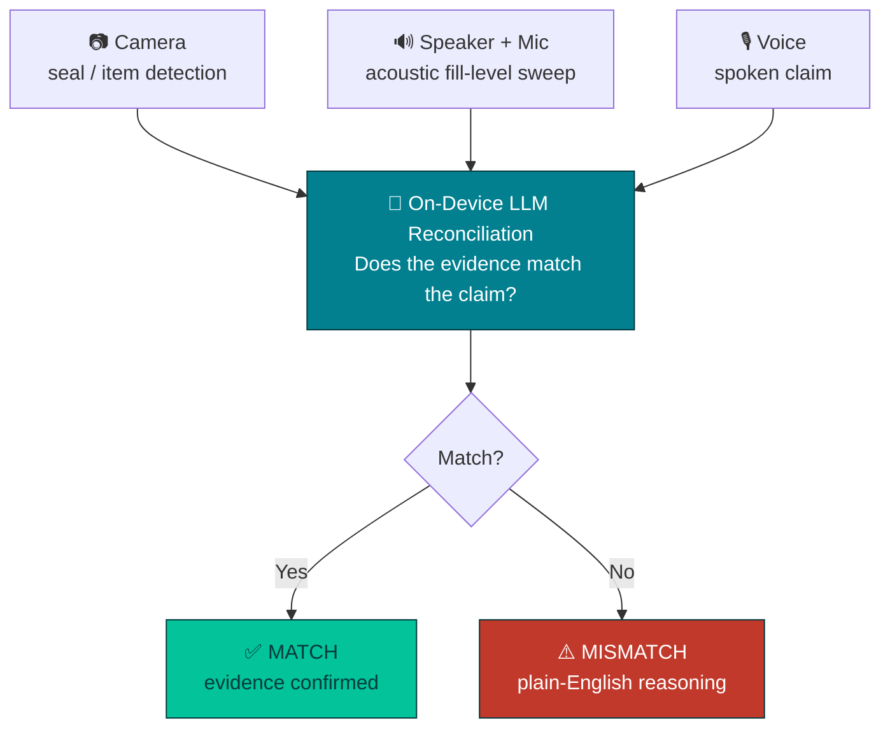

<div align="center">

# GroundTruth

**Say what happened. The phone checks if it's true.**

An offline-first Progressive Web App that independently verifies field-delivery claims — catching LPG cylinder under-filling and tampering in seconds, entirely on-device, with zero connectivity required.

[**Live Demo**](https://6a89e05ae350dfd664c35636--splendorous-sable-b083e5.netlify.app/)

</div>

---

## Table of Contents

- [The Problem](#the-problem)
- [How It Works](#how-it-works)
- [Key Features](#key-features)
- [Why the Phone](#why-the-phone)
- [Tech Stack](#tech-stack)
- [Getting Started](#getting-started)
- [Testing & Validation](#testing--validation)
- [Project Structure](#project-structure)
- [FAQ](#faq)
- [Acknowledgments](#acknowledgments)
- [License](#license)

---

## The Problem

LPG delivery in India runs almost entirely on trust: an agent states what was delivered, and that claim is rarely independently checked — especially at doorsteps and in low-connectivity areas where a cloud-based tool couldn't help anyway. Tampered seals and under-filled cylinders are a widely reported, ongoing consumer-safety issue, and the trust gap runs both ways: customers have no fast way to verify what they received, and honest agents have no fast way to defend against false disputes.

GroundTruth is deliberately dual-use — the same app, the same on-device pipeline, works for whoever's holding the phone at the point of delivery. It's a neutral witness, not a tool that only serves one side.

## How It Works

A worker or customer photographs the cylinder, taps it for an acoustic check, and speaks their claim. GroundTruth gathers all three signals independently and reconciles them on-device — the claim is no longer the end of the story, it's one input that gets checked.



Every step above runs **client-side, in the browser** — no backend, no network call at inference time. Once the models are cached, the entire pipeline works in airplane mode.

## Key Features

| | Feature | Description |
|---|---|---|
| 🎯 | **Trust Ring** | A single visual motif reused across the app — a muted ring on Home before any check has run, filling with color the instant a verdict lands (teal for Match, red for Mismatch) |
| 📳 | **Sensory verdict feedback** | A mismatch triggers a distinct vibration pattern, a red screen flash, and a synthesized alarm tone; a match gets a lighter pulse and a soft chime — built on the Vibration and Web Audio APIs, no audio files needed |
| 🧾 | **Shareable receipts** | Every verdict can be shared via the native OS share sheet or saved as a file, so a check has a record that outlasts the screen |
| 📴 | **True offline-first** | Installs to the home screen, caches its own shell via a service worker, and runs AI inference with zero network calls once loaded |
| 🔊 | **Acoustic sensing** | Uses the phone's own speaker + mic as an active sonar — no extra hardware, no sensors, no accessories |
| 📱 | **Phone-first responsive UI** | The app frame stays phone-shaped even in a desktop browser window; every touch target meets accessibility sizing guidance |

## Why the Phone

- **Camera** — the primary evidence source, detecting what's actually in front of it, not what's claimed
- **Speaker + mic** — an active tone sweep senses fill-level via resonance; the same hardware every phone already has
- **On-device GPU (WebGPU)** — runs the local LLM reconciliation entirely on-device, no cloud round-trip
- **Offline-first** — the full pipeline works with zero connectivity, exactly where field verification is needed most

## Tech Stack

| Layer | Technology | Why |
|---|---|---|
| App shell | [Vite](https://vitejs.dev/) + [vite-plugin-pwa](https://vite-pwa-org.netlify.app/) | Installable, offline-capable PWA with zero native build tooling |
| Vision | [MediaPipe Tasks Vision](https://ai.google.dev/edge/mediapipe) — Object Detector | Pretrained, on-device, no training data needed |
| Speech | Web Speech API / [transformers.js](https://huggingface.co/docs/transformers.js) (Whisper) | Fast MVP path or fully-local alternative |
| Acoustic sensing | Web Audio API — tone sweep + FFT analysis | No native audio APIs required, works in any modern browser |
| Reasoning | [WebLLM](https://webllm.mlc.ai/) — `Qwen2.5-1.5B-Instruct`, on-device via WebGPU | Genuine local LLM inference, not a cloud API call |
| Feedback | Vibration API + Web Audio API | Synthesized tones — no audio assets to ship |
| Storage | IndexedDB | Offline-durable local history |
| Hosting | Netlify | Static, HTTPS by default (required for camera/mic access) |

## Getting Started

### Prerequisites

- [Node.js](https://nodejs.org/) 18+ and npm
- A modern browser with WebGPU support (Chrome 121+ on Android/desktop) for full on-device inference

### Installation

```bash
git clone <this-repo-url>
cd groundtruth-starter
npm install
```

### Running locally

```bash
npm run dev       # starts Vite at http://localhost:5173
```

Camera and mic access require a **secure context** — `https://` or `localhost`. To test on a physical phone during development without deploying:

1. Connect the phone via USB (or use a device bridge like Office Kit)
2. On the laptop, open `chrome://inspect#devices` → Port forwarding → map device port `5173` → `localhost:5173`
3. On the phone, open `http://localhost:5173` in Chrome — treated as secure

### Building for production

```bash
npm run build      # production build → dist/
npm run preview    # serve the production build locally
```

## Testing & Validation

Each stage of the pipeline has a **standalone, working test page** under `/playground` — these are real, runnable validations, not mockups:

| Playground | Validates | What it does |
|---|---|---|
| `webllm-test.html` | Reasoning | Loads a quantized LLM fully in-browser via WebGPU and runs a test reconciliation prompt |
| `mediapipe-test.html` | Vision | Freeze-frame object detection with trial logging — computes a real detection-reliability % |
| `whisper-test.html` | Speech | Fully on-device transcription via transformers.js, with accuracy trial logging |
| `acoustic-test.html` | Acoustic sensing | Plays a tone sweep, records the response, and computes real full/empty separation accuracy against saved reference containers |

Each one accumulates real trial data and can export a copy-ready results summary — no invented numbers.

## Project Structure

```
groundtruth-starter/
├── index.html                # App shell entry point
├── vite.config.js            # Vite + PWA plugin config
├── src/
│   ├── main.js                # Screen router, UI components, icon set
│   ├── feedback.js            # Vibration + flash + tone feedback module
│   ├── receipt.js             # Verdict receipt generation + share/export
│   └── style.css              # Design tokens, Trust Ring, responsive layout
├── playground/
│   ├── webllm-test.html       # LLM reasoning validation
│   ├── mediapipe-test.html    # Vision detection validation
│   ├── whisper-test.html      # Speech-to-text validation
│   └── acoustic-test.html     # Acoustic sensing validation
└── public/
    ├── icon-192.png
    └── icon-512.png
```

## FAQ

<details>
<summary><strong>Does this actually work without internet?</strong></summary>
<br>
Yes — that's the entire point. Every AI model (vision, speech, reasoning) runs client-side via WebGPU/WASM. Once the models are cached on first load, the app functions fully in airplane mode.
</details>

<details>
<summary><strong>Why a PWA instead of a native Android app?</strong></summary>
<br>
No native build tooling, no app-store distribution, no backend to deploy — and it still installs to the home screen, runs full-screen, and works offline.
</details>

<details>
<summary><strong>Can it detect physical damage, not just fill level?</strong></summary>
<br>
Not currently. The vision model is a general-purpose pretrained detector — reliable for presence/absence/seal checks, not fine-grained damage classification, which would require a custom-trained model.
</details>

<details>
<summary><strong>Does the acoustic sensing need special hardware?</strong></summary>
<br>
No — it uses the phone's existing speaker and microphone as an active sonar (play a tone sweep, analyze the response). No sensors, no accessories.
</details>

<details>
<summary><strong>Is my data sent anywhere?</strong></summary>
<br>
No. There is no backend server. All capture, inference, and storage happen on-device.
</details>

## Acknowledgments

Built with [Vite](https://vitejs.dev/), [MediaPipe](https://ai.google.dev/edge/mediapipe), [WebLLM](https://webllm.mlc.ai/), and [transformers.js](https://huggingface.co/docs/transformers.js). Buttons adapted from a [Uiverse.io](https://uiverse.io/) design by TemRevil.

Implementation patterns validated against Google's [mediapipe-samples-web](https://github.com/google-ai-edge/mediapipe-samples-web) and Xenova's [whisper-web](https://github.com/xenova/whisper-web) reference apps. The acoustic-sensing approach independently confirms the same principle documented in the academic toolkit [LibAcousticSensing](https://github.com/yctung/LibAcousticSensing) — implemented from scratch here via the Web Audio API, since that toolkit requires a native app and a networked MATLAB server, incompatible with an offline, in-browser PWA.

## License

MIT
