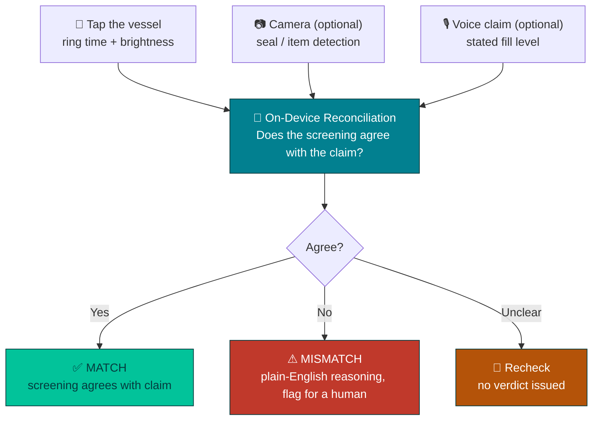

<div align="center">

# GroundTruth

**Say what happened. The phone checks if it's true.**

An offline-first Progressive Web App that independently verifies field-delivery claims — catching LPG cylinder under-filling and tampering in seconds, entirely on-device, with zero connectivity required.

[**Live Demo**](https://ground-truth-blush.vercel.app/)

</div>

---

## Table of Contents

- [The Problem](#the-problem)
- [How It Works](#how-it-works)
- [Key Features](#key-features)
- [The Fill Estimate, and What It Is Not](#the-fill-estimate-and-what-it-is-not)
- [The tap test](#the-tap-test)
- [Consumption rate and time-to-empty](#consumption-rate-and-time-to-empty)
- [Contamination and damage screening](#contamination-and-damage-screening)
- [Why the Phone](#why-the-phone)
- [Tech Stack](#tech-stack)
- [Getting Started](#getting-started)
- [Testing & Validation](#testing--validation)
- [Project Structure](#project-structure)
- [FAQ](#faq)
- [Team](#team)
- [Acknowledgments](#acknowledgments)
- [License](#license)

- [License](#license)

---

## The Problem

LPG delivery in India runs almost entirely on trust: an agent states what was delivered, and that claim is rarely independently checked — especially at doorsteps and in low-connectivity areas where a cloud-based tool couldn't help anyway. Tampered seals and under-filled cylinders are a widely reported, ongoing consumer-safety issue, and the trust gap runs both ways: customers have no fast way to verify what they received, and honest agents have no fast way to defend against false disputes.

GroundTruth is deliberately dual-use — the same app, the same on-device pipeline, works for whoever's holding the phone at the point of delivery. It's a neutral witness, not a tool that only serves one side.

## How It Works

A worker or customer **taps the vessel** and GroundTruth screens its response against locally
calibrated references. Optionally the worker also photographs the container and speaks their claim;
GroundTruth gathers the signals independently and reconciles them on-device — the claim is no longer
the end of the story, it is one input that gets checked.



Every step above runs **client-side, in the browser** — no backend, no network call at inference time. Once the models are cached, the entire pipeline works in airplane mode.

## Key Features

| | Feature | Description |
|---|---|---|
| 🎯 | **Trust Ring** | A single visual motif reused across the app — a muted ring on Home before any check has run, filling with color the instant a verdict lands (teal for Match, red for Mismatch) |
| 📳 | **Sensory verdict feedback** | A mismatch triggers a distinct vibration pattern, a red screen flash, and a synthesized alarm tone; a match gets a lighter pulse and a soft chime — built on the Vibration and Web Audio APIs, no audio files needed |
| 🧾 | **Shareable receipts** | Every verdict can be shared via the native OS share sheet or saved as a file, so a check has a record that outlasts the screen |
| 📴 | **True offline-first** | Installs to the home screen, caches its own shell via a service worker, and runs AI inference with zero network calls once loaded |
| 🔊 | **Acoustic sensing** | Plays 16 controlled tones (300–7550 Hz) and compares the response against this device's saved Full/Empty references — no extra hardware, no sensors, no accessories |
| 📱 | **Phone-first responsive UI** | The app frame stays phone-shaped even in a desktop browser window; every touch target meets accessibility sizing guidance |
| 📉 | **Trend, forecast & manager alert** | Repeated tap screens on one vessel build a fill-over-time series; least-squares regression turns it into a consumption rate and a time-to-empty *range*, and can draft a manager alert email (never sent automatically) |
| 🧪 | **Contamination / damage screen** | Compares a vessel only against its *own* earlier taps; a ring-shape change at a comparable level flags water, oil, rust, or particulate for human inspection |

## The Fill Estimate, and What It Is Not

The acoustic screen may show an **Estimated fill level**, an integer from 0 to 100. It is produced by
two-anchor interpolation: the capture's cosine similarity to the locally calibrated Full reference is
divided by the sum of its similarities to the Full and Empty references.

It is deliberately described as an *estimate*, because that is what it is:

- It is **relative to two local anchors** recorded on this specific phone, in one position, at one
  volume. It is not a weight, a certified gas volume, or a regulated measurement.
- The estimate is **withheld entirely** (replaced with "Recheck acoustic capture") when calibration is
  missing or overlapping, when the captured signal is too weak or loud enough to clip, or when the
  result is otherwise not trustworthy. The UI cannot show a confident-looking percentage from bad input.
- Reconciliation treats the percentage as **directional evidence only**. It is compared against the
  spoken claim solely when the claim states a fill level in reliably readable words. An unclear,
  absent, or partially readable claim can never on its own produce a mismatch; the result is Recheck.

Validating this properly requires a labelled dataset of real captures, split by container rather than
by random capture, and reported with accuracy and false-positive rates before the estimate informs any
real decision.

### Measuring before modelling

The **Dataset Capture** screen (reachable from Acoustic Calibration) exists to collect that evidence, and
to answer the gate question first: *are repeat readings of the same container more similar to each other
than Full and Empty readings are to each other?* If they are not, no classifier can help and the
measurement geometry has to change.

Each stored sample keeps the full 16-bin fingerprint plus the metadata needed to compare sessions —
container ID, stated label provenance, condition, room, device model, media volume, overall level, RMS,
peak bin positions, sample rate, and environment. Labels are required and their source must be stated
(ideally a measured weight); an unlabelled capture is not training data. Exports are JSON and CSV, and a
dataset can be merged back in from another device.

The separability readout compares **mean-centred (shape) similarity**, not raw cosine similarity. Raw
cosine on these dB vectors is dominated by the large negative level offset, so two spectra with very
different shapes still score around 0.97 — which is exactly why the current live classifier can look
confident while carrying almost no fill-level information. The screen reports both metrics so the
difference is visible rather than assumed.

### The tap test

The tone sweep measures **steady loudness**, and loudness is the one property a full and an empty
container share: the six saved references differed by 0.31 dB on average, against 2.6–3.9 dB of
repeat-to-repeat noise. The classes overlapped, and the app correctly refused to decide.

Tapping the container instead excites the shell and the air column, and the **ring time** and
**brightness** differ strongly between fill states. It also needs no speaker at all, which removes the
speaker-to-microphone chassis leak that dominated the sweep. Measured on synthetic-but-realistic
responses, ring time and spectral centroid separate by roughly 7x between a sharp metallic ring and a
damped thud.

The tap test is the **primary method**, launched from *Start new check* on Home. The camera, voice
claim, and tone sweep remain available as a secondary, optional path.

Because the response is graded rather than binary, calibration is **not** limited to Full and Empty:
you can save any level that physically separates, including intermediate ones such as 50% or 80%.
Results are reported as the nearest calibrated level, never as an invented precise figure, and the app
returns *recheck* whenever the two closest levels are too near each other to separate, the strike
clipped the microphone, or the strike was too quiet above the room's own noise floor.

Strikes are recorded as **raw PCM**, not through MediaRecorder: a lossy codec smears transients, and
decay time is the primary feature, so encoding would damage exactly the signal being measured. The
striker is tracked per level, because mixing strikers inside one level blends two different excitation
signals into a reference average that means nothing.

### Consumption rate and time-to-empty

A single reading cannot produce a rate: a rate is a change divided by a time interval. Differencing two
readings multiplies the measurement noise, so the module fits a **least-squares regression** across many
readings instead, which averages the noise down. Simulated with 10% level noise, a two-reading difference
gives a rate whose error exceeds the answer itself, while a fit across ten readings over two weeks
recovers the true rate and bounds time-to-empty to roughly +/- 8 days.

Consequently a forecast is only shown when there are at least **10 readings spanning about 7 days**. It
is always reported as a **range with a 95% confidence interval**, derived by error propagation on the
fitted intercept and slope rather than a fixed fudge factor. A flat or rising fit returns *stable* with no
empty date; a weak fit is reported as weak rather than hidden; and an apparent refill must be a sustained
step, not a one-off spike, before the history behind it is discarded.

### Contamination and damage screening

A clean vessel rings the same way every time. A ring *shape* (mean-centred spectral fingerprint) that
drifts away from that vessel's own earliest captures, at a comparable fill level, points to a changed
contents or a changed shell condition: water, oil, rust, or particulate in the liquid. This compares a
vessel only against its **own** history, never against another vessel, because two different cylinders
legitimately ring differently and a cross-vessel comparison would be meaningless. A flag is a reason to
inspect, never a diagnosis.

## Why the Phone

- **Tap response** — the primary signal: a strike excites the shell and air column, and ring time and brightness separate strongly between fill states. Needs no speaker and no accessory beyond the phone in your hand
- **Camera (optional)** — a supporting signal that detects what is actually in front of it, not what is claimed
- **Speaker + mic (optional)** — the legacy 16-tone sweep, retained as a secondary path with locally calibrated Full and Empty anchors
- **On-device reconciliation** — deterministic rules decide first; the local WebGPU LLM adapter, when enabled, obeys the same guardrails
- **Offline-first** — the full pipeline works with zero connectivity, exactly where field screening is needed most

## Tech Stack

| Layer | Technology | Why |
|---|---|---|
| App shell | [Vite](https://vitejs.dev/) + [vite-plugin-pwa](https://vite-pwa-org.netlify.app/) | Installable, offline-capable PWA with zero native build tooling |
| Vision | [TensorFlow.js](https://www.tensorflow.org/js) + COCO-SSD MobileNet v2 | Current on-device general object-in-frame signal; MediaPipe remains available only as a comparison playground |
| Speech | Web Speech API / [transformers.js](https://huggingface.co/docs/transformers.js) (Whisper) | Fast MVP path or fully-local alternative |
| Acoustic sensing | Web Audio API — 16 sine tones + per-tone FFT peak | No native audio APIs required, works in any modern browser |
| Reasoning | [WebLLM](https://webllm.mlc.ai/) — `Qwen2.5-1.5B-Instruct`, on-device via WebGPU | Genuine local LLM inference, not a cloud API call |
| Feedback | Vibration API + Web Audio API | Synthesized tones — no audio assets to ship |
| Storage | IndexedDB | Offline-durable local history |
| Hosting | Netlify | Static, HTTPS by default (required for camera/mic access) |

## Getting Started

### Prerequisites

- [Node.js](https://nodejs.org/) 18+ and npm
- A modern browser with WebGPU support (Chrome 121+ on Android/desktop) for full on-device inference

### Installation

```bash
git clone <this-repo-url>
cd groundtruth-starter
npm install
```

### Running locally

```bash
npm run dev       # starts Vite at http://localhost:5173
```

Camera and mic access require a **secure context** — `https://` or `localhost`. To test on a physical phone during development without deploying:

1. Connect the phone via USB (or use a device bridge like Office Kit)
2. On the laptop, open `chrome://inspect#devices` → Port forwarding → map device port `5173` → `localhost:5173`
3. On the phone, open `http://localhost:5173` in Chrome — treated as secure

### Building for production

```bash
npm run build      # production build → dist/
npm run preview    # serve the production build locally
```

## Testing & Validation

Each stage of the pipeline has a **standalone, working test page** under `/playground` — these are real, runnable validations, not mockups:

| Playground | Validates | What it does |
|---|---|---|
| `webllm-test.html` | Reasoning | Loads a quantized LLM fully in-browser via WebGPU and runs a test reconciliation prompt |
| `tfjs-coco-ssd-test.html` | Vision | TensorFlow.js COCO-SSD MobileNet v2 freeze-frame detection with trial logging, confidence, and inference timing |
| `lpg-seal-classifier.html` | Custom vision training | On-device MobileNet + KNN training from locally reviewed seal images, held-out validation, and uploaded-image testing |
| `mediapipe-test.html` | Legacy vision comparison | Freeze-frame MediaPipe object detection retained for side-by-side test results |
| `whisper-test.html` | Speech | Fully on-device transcription via transformers.js, with accuracy trial logging |
| `acoustic-test.html` | Acoustic sensing | Plays the tone sweep, records the response, and computes real full/empty separation accuracy against saved reference containers |

Each one accumulates real trial data and can export a copy-ready results summary — no invented numbers.

## Project Structure

```
groundtruth-starter/
├── index.html                # App shell entry point
├── vite.config.js            # Vite + PWA plugin config
├── src/
│   ├── main.js                # Legacy imperative build; not the active entry point
│   ├── acoustic.js            # Tone sweep, FFT capture, fingerprint, cosine similarity
│   ├── acoustic-store.js      # Calibration storage, classification, fill interpolation
│   ├── vision.js              # MobileNet embeddings + can-lid opening detector
│   ├── speech.js              # Browser audio decode + Whisper adapter
│   ├── reconcile.js           # Deterministic conservative decision rules
│   ├── llm.js                 # Optional on-device WebLLM adapter (not wired in)
│   ├── check-store.js         # Legacy IndexedDB check store
│   ├── feedback.js            # Vibration + flash + tone feedback module
│   ├── provider-email.ts      # Provider report draft builder (mailto, never sends)
│   ├── dataset-store.js       # Labelled capture store + separability analysis
│   ├── tap.js                 # Tap-response capture, ring-time + brightness features
│   ├── tap-store.js           # Multi-level tap calibration and nearest-level classification
│   ├── consumption.js          # Least-squares trend fit + time-to-empty range + refill segmentation
│   ├── style.css              # Design tokens, Trust Ring, responsive layout
│   └── ui/                    # Active React app: App.tsx, screens/ (incl. TapCheck, TapCalibration, VesselTrend), components/
├── public/
│   ├── can-seal-references/   # 7 sealed + 6 unsealed reference photos (vision)
│   └── playground/            # Directory of device-ready validation checks
│       ├── index.html
│       ├── webllm-test.html
│       ├── lpg-seal-classifier.html
│       ├── mediapipe-test.html
│       ├── tfjs-coco-ssd-test.html
│       ├── whisper-test.html
│       └── acoustic-test.html
│   ├── icon-192.png
│   └── icon-512.png
```

## FAQ

<details>
<summary><strong>Does this actually work without internet?</strong></summary>
<br>
Yes — that's the entire point. Every AI model (vision, speech, reasoning) runs client-side via WebGPU/WASM. Once the models are cached on first load, the app functions fully in airplane mode.
</details>

<details>
<summary><strong>Why a PWA instead of a native Android app?</strong></summary>
<br>
No native build tooling, no app-store distribution, no backend to deploy — and it still installs to the home screen, runs full-screen, and works offline.
</details>

<details>
<summary><strong>Can it detect physical damage, not just fill level?</strong></summary>
<br>
Not currently. The vision model is a general-purpose pretrained detector — reliable for presence/absence/seal checks, not fine-grained damage classification, which would require a custom-trained model.
</details>

<details>
<summary><strong>Does the acoustic sensing need special hardware?</strong></summary>
<br>
No — it uses the phone's existing speaker and microphone as an active sonar (play a tone sweep, analyze the response). No sensors, no accessories.
</details>

<details>
<summary><strong>Is my data sent anywhere?</strong></summary>
<br>
No. There is no backend server. All capture, inference, and storage happen on-device.
</details>

## Acknowledgments

Built with [Vite](https://vitejs.dev/), [MediaPipe](https://ai.google.dev/edge/mediapipe), [WebLLM](https://webllm.mlc.ai/), and [transformers.js](https://huggingface.co/docs/transformers.js). Buttons adapted from a [Uiverse.io](https://uiverse.io/) design by TemRevil.

Implementation patterns validated against Google's [mediapipe-samples-web](https://github.com/google-ai-edge/mediapipe-samples-web) and Xenova's [whisper-web](https://github.com/xenova/whisper-web) reference apps. The acoustic-sensing approach independently confirms the same principle documented in the academic toolkit [LibAcousticSensing](https://github.com/yctung/LibAcousticSensing) — implemented from scratch here via the Web Audio API, since that toolkit requires a native app and a networked MATLAB server, incompatible with an offline, in-browser PWA.

## Team

Built by **Shivesh Kumar** and **Madalam Sai Jeevan**.

## License

MIT — see [LICENSE](LICENSE).
